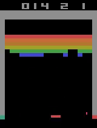

# Deep RL Breakout

Welcome to my Deep RL Breakout project! This repository contains code for training an agent to play Atari Breakout using Deep Q-Networks (DQN) with the help of the [rl-baselines3-zoo](https://github.com/DLR-RM/rl-baselines3-zoo) library.

---

## Overview

Traditional Q-learning uses a Q-table, which is impractical for environments with huge state spaces. For example, a 210×110 pixel image with 3 RGB channels leads to roughly 256^(210×110×3) possible states—way too many! Instead, we leverage deep neural networks to approximate the Q-values directly from pixel inputs, making the problem manageable.

This repo demonstrates training a DQN agent on the ALE/Breakout-v5 environment with the following key details:

- **Environment:** ALE/Breakout-v5 with AtariWrapper and frame stacking (4 frames)
- **Policy:** CnnPolicy
- **Training Steps:** 1M timesteps
- **Other Hyperparameters:** Configured for buffer size, learning rate, batch size, exploration settings, etc.

---

## Model Configuration

Below is a snippet of the model configuration used for training:

```yaml
model: ALE/Breakout-v5:
  env_wrapper:
    - stable_baselines3.common.atari_wrappers.AtariWrapper
  frame_stack: 4
  policy: 'CnnPolicy'
  n_timesteps: !!float 1e6
  buffer_size: 100000
  learning_rate: !!float 1e-4
  batch_size: 64
  learning_starts: 100000
  target_update_interval: 1000
  train_freq: 4
  gradient_steps: 1
  exploration_fraction: 0.1
  exploration_final_eps: 0.01
  optimize_memory_usage: False
```
